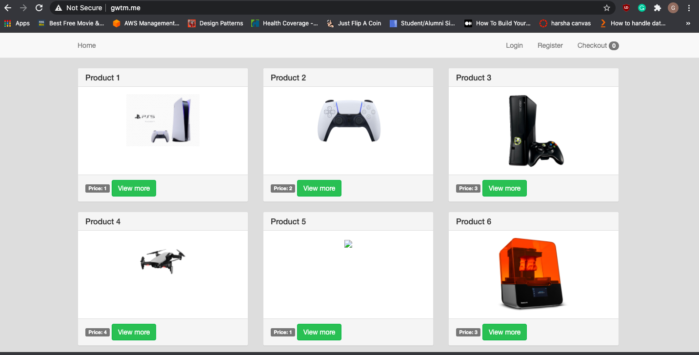
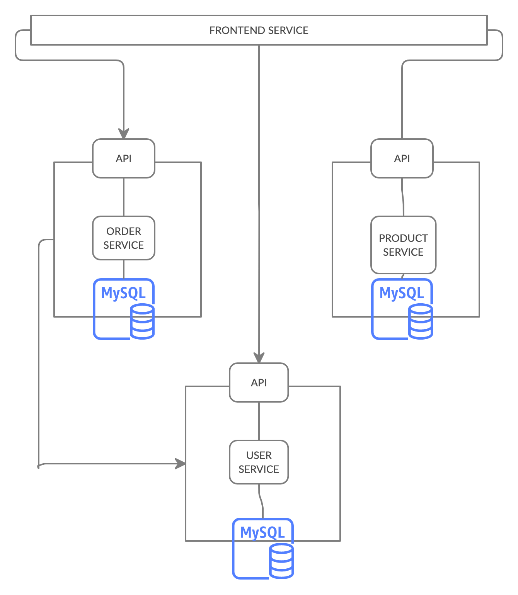
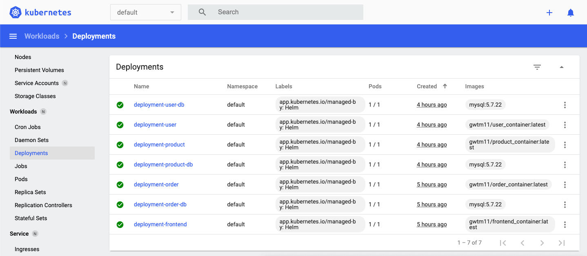

# Multicontainer Orchestration

A retail app that maintains a separate active directory for the user and DB to store product information.

*Each Module in this application is decoupled to create a microservice architecture* 

When Deployed 7 diffrent pods get created in AWS with High availability in diffrent AZ with bastion host to reach private subnets. 

### maximize availability
*To setup max availability the pods are deployed in multi-az environment*

### Load testing
*In Jenkins setup, for each build all the deployments undergo several layers of load and performance testing*

### Security
* *Service account and role binding can be setup for k8 clusters to ensure security*
* *Secured TLS endpoints can be implemented*
* *Encryption at rest and in transit*
* *ELK stack can be deployed on all the pods to get the logs*


=======================LIVE APP======================================
please click the below link to view the app
```
http://gwtm.me/
```
=======================LIVE APP=======================================




===============================APP FEATURES================================
* Simple Web APP
* Dockerzied
* KOPS Cluster 
* JENKINS - CI/CD Setup
* HELM Installation 
* Service Discovery via k8 service account
* Swagger API Documentation
* Session Based Authentication
* DB instances in diffrent pods communicate and persist a single DB
* 6 Instance running in multiple AZs
* Bastion Hosts to reach private instances.
* Hosted in AWS Route 53 
* Deployments using docker compose

===============================APP FEATURES====================================




 ============= Installation GUIDE==============================================

Required Installations

* KOPS
* HELM
* Kubectl
* Docker 
* Minkube
* Boto3 

### Create K8 Cluster and Setup JENKINS CI/CD pipeline

 Follow README from[Infrastructure AWS](https://github.com/Gwtm11/Infrastructure-AWS)
 * [Create KOPS cluster](https://github.com/Gwtm11/Infrastructure-AWS/tree/main/Infrastructure-kubernetes)
 * [Create Jenkins instance in AWS to setup CI/CD ](https://github.com/Gwtm11/Infrastructure-AWS/tree/main/infrastructure-jenkins)


## Setup k8 dashboard

 =============K8s DASHBOARD=============
#### Step 1 Get dashboard pod
```
kubectl apply -f https://raw.githubusercontent.com/kubernetes/dashboard/v2.0.0/aio/deploy/recommended.yaml
```

#### Step 2 Set Service account

```
cat <<EOF | kubectl apply -f -
apiVersion: v1
kind: ServiceAccount
metadata:
  name: admin-user
  namespace: kubernetes-dashboard
EOF
```

#### Step 3: Set Role binding for the cluster
```
cat <<EOF | kubectl apply -f -
apiVersion: rbac.authorization.k8s.io/v1
kind: ClusterRoleBinding
metadata:
  name: admin-user
roleRef:
  apiGroup: rbac.authorization.k8s.io
  kind: ClusterRole
  name: cluster-admin
subjects:
- kind: ServiceAccount
  name: admin-user
  namespace: kubernetes-dashboard
EOF
```

#### Step 4: Get Secret Token

```
kubectl -n kubernetes-dashboard describe secret $(kubectl -n kubernetes-dashboard get secret | grep admin-user | awk '{print $1}')
```

#### Step 5: Set proxy
```
kubectl proxy
```
### View Dashboard

```
http://localhost:8001/api/v1/namespaces/kubernetes-dashboard/services/https:kubernetes-dashboard:/proxy/
```

### HELM INSTALLATION

After setting up K8 dashboard, Start deploying the pods into cluster.

#### Step 1: Deploy frontend app:
move to the frontend directory
```
helm install frontend ./helm/frontend
```

#### Step 2: Deploy frontend app:
move to the order_service directory
```
helm install order ./helm/order
```

#### Step 3: Deploy frontend app:
move to the product_service directory
```
helm install product ./helm/product
```

#### Step 4: Deploy frontend app:
move to the user_service directory
```
helm install user ./helm/user
```


#### TEARDOWN
```
helm uninstall frontend
helm uninstall order
helm uninstall product
helm uninstall user
```

### TO create cluster locally

* Install Minkube

* Get kube context
```
kubectl config get-contexts
```
* Switch to minkube
```
kubectl config use-context CONTEXT_NAME
```
* Start helm installation

* After succesfull deployment, start minikube tunnel to connect to load balancer

```
minikube tunnel
```


#### After Deployment




